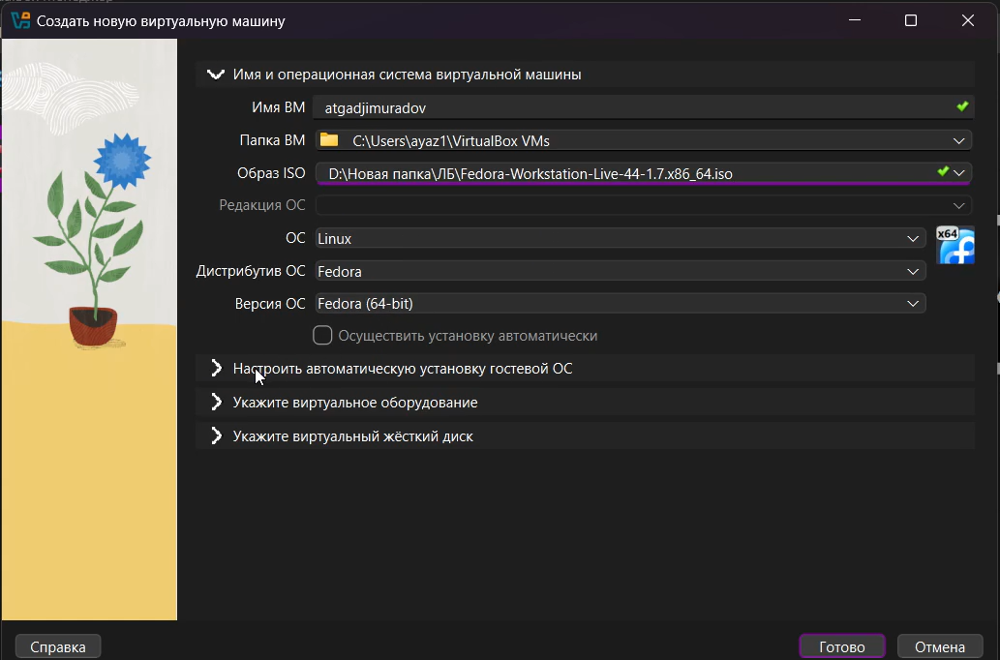
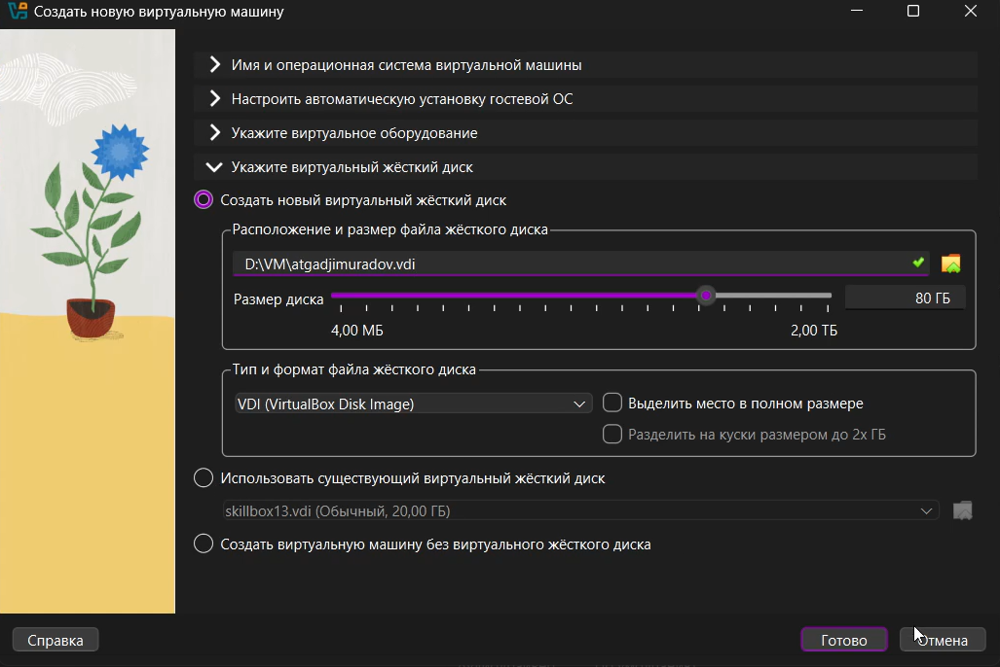
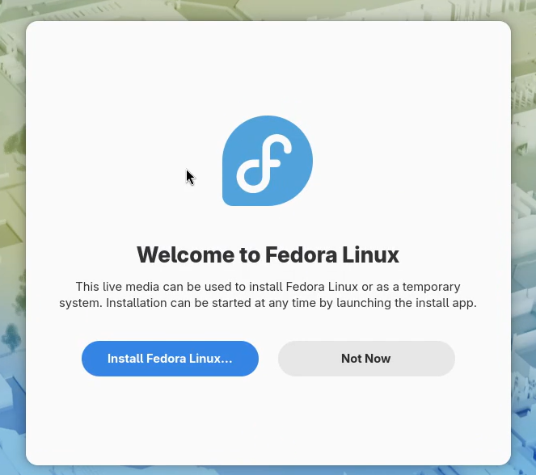
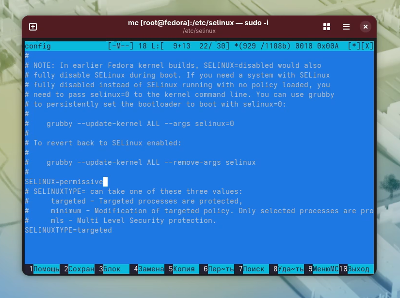
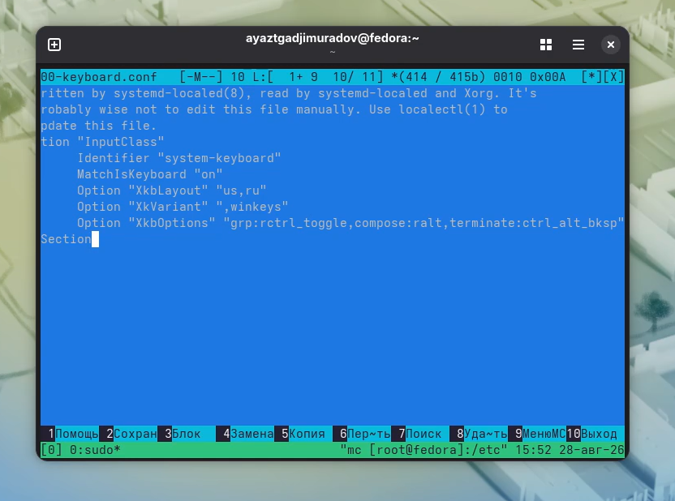

## Цель работы

Целью данной работы является приобретение практических навыков установки операционной системы на виртуальную машину, настройки минимально необходимых для дальнейшей работы сервисов.

## Задание

1. Создание виртуальной машины
2. Установка операционной системы
3. Работа с операционной системой после установки
4. Установка программного обеспечения для работы с документацией
5. Дополнительные задания

## Создание виртуальной машины

Для создания виртуальной машины нам потребуется менеджер виртуальных машин VirtualBox.
1. Нажимаем создать. 
2. В появившемся окне придумываем имя для ВМ.
3. Выбираем заранее скачанный ISO образ Fedora

{width=70%}

## Создание виртуальной машины

4. Выбираем количество оперативной памяти и число процессоров.

{width=70%}

## Создание виртуальной машины

5. Указываем размер диска 80ГБ.
6. Перезапускаем машину.

{width=70%}

## Установка операционной системы

1. После перезагрузки у нас появится привественное окно, нажимаем install fedora linux.
2. Дальше создаем учетную запись по инстуркции на экране и ждем конца установки ОС.
3. После завершения установки перезапускаем ВМ.

{width=70%}

## Работа с ОС после установки

1. Установка драйверов для VirtualBox
Запускаем терминальный мультиплексор tmux:
tmux
Переключитесь на роль супер-пользователя:
sudo -i
Установите средства разработки:
dnf -y group install development-tools
Установите пакет DKMS:
dnf -y install dkms
В меню виртуальной машины подключите образ диска дополнений гостевой ОС.
Подмонтируйте диск:
mount /dev/sr0 /media
Установите драйвера:
/media/VBoxLinuxAdditions.run
Перегрузите виртуальную машину:
reboot

## Работа с ОС после установки

2. Обновления 

Установите средства разработки:
sudo dnf -y group install development-tools
Обновить все пакеты
sudo dnf -y update

## Работа с ОС после установки

3. Автоматическое обновление

При необходимости можно использовать автоматическое обновление.
Установка программного обеспечения:
sudo dnf -y install dnf-automatic
Задаёте необходимую конфигурацию в файле /etc/dnf/automatic.conf.
Запустите таймер:
sudo systemctl enable --now dnf-automatic.timer

## Работа с ОС после установки

4. Отключение SELinux

Отредактируйте конфигурационный файл /etc/X11/xorg.conf.d/00-keyboard.conf:

{width=70%}

## Работа с ОС после установки

Для этого можно использовать файловый менеджер mc и его встроенный редактор.

{width=70%}

## Работа с ОС после установки

{width=70%}

Перегрузите виртуальную машину:

sudo systemctl reboot

## Работа с ОС после установки

6. Установка имени пользователя и названия хоста

Создайте пользователя (вместо username укажите ваш логин в дисплейном классе):
adduser -G wheel username
Задайте пароль для пользователя (вместо username укажите ваш логин в дисплейном классе):
passwd username
Устаовите имя хоста (вместо username укажите ваш логин в дисплейном классе):
hostnamectl set-hostname username
Проверьте, что имя хоста установлено верно:
hostnamectl

{width=70%}

## Установка программного обеспечения для создания документации

1. Работа с языком разметки Markdown

    Средство pandoc для работы с языком разметки Markdown.
    Лучше установить pandoc и pandoc-crossref вручную.
    Скачайте необходимую версию pandoc-crossref (https://github.com/lierdakil/pandoc-crossref/releases).
    Посмотрите, для какой версии откомпилён pandoc-crossref.
    Скачайте соответствующую версию pandoc (https://github.com/jgm/pandoc/releases).
    Распакуйте архивы.Обе программы собраны в виде статически-линкованных бинарных файлов.
    Поместите их в каталог /usr/local/bin.
    
## Выводы

В ходе выполнения лабораторной работы были успешно приобретены практические навыки установки операционной системы на виртуальную машину и настройки базовых сервисов.
    
##

Спасибо за внимание!

---
