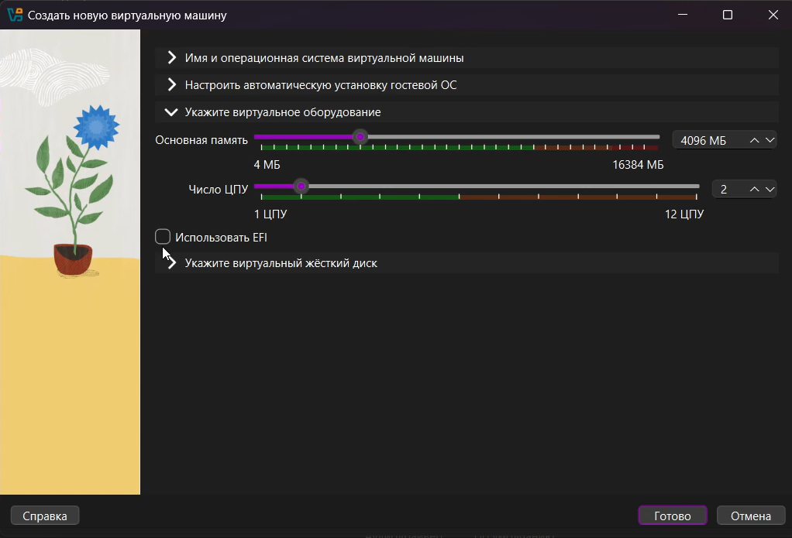
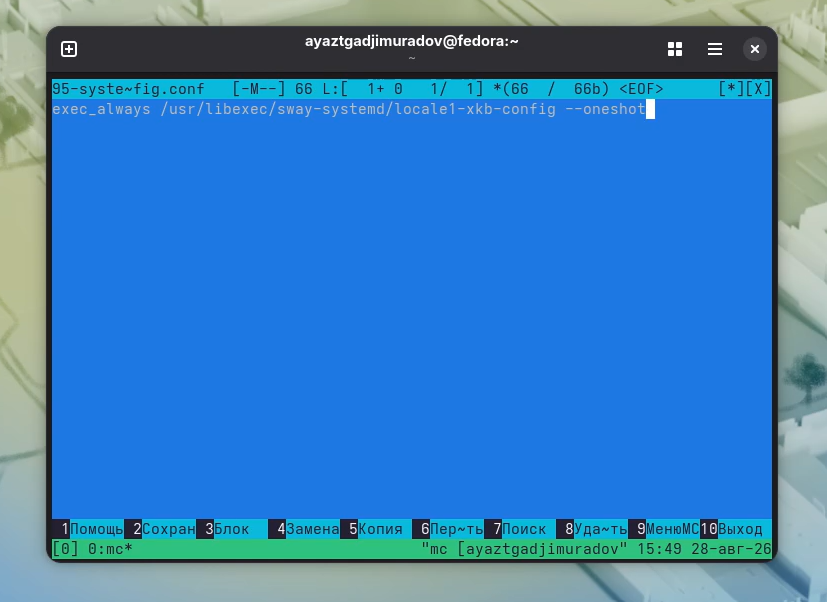
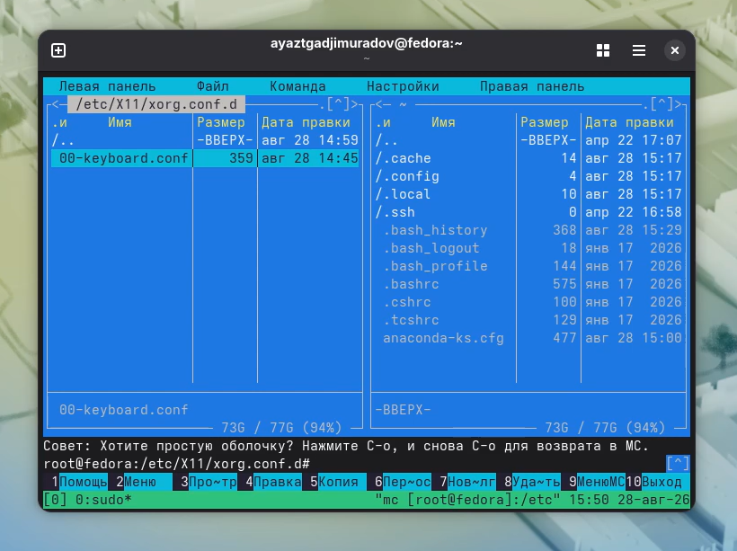
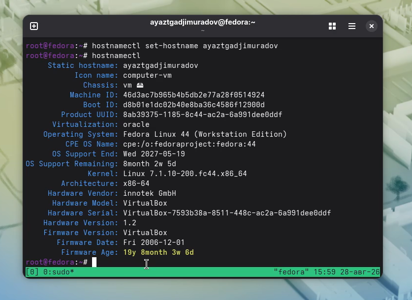
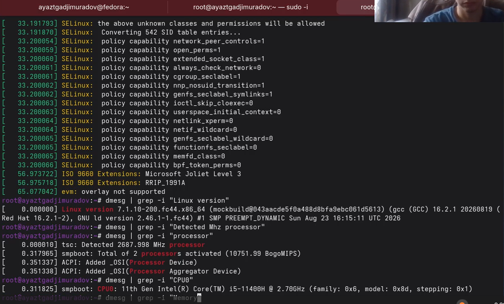
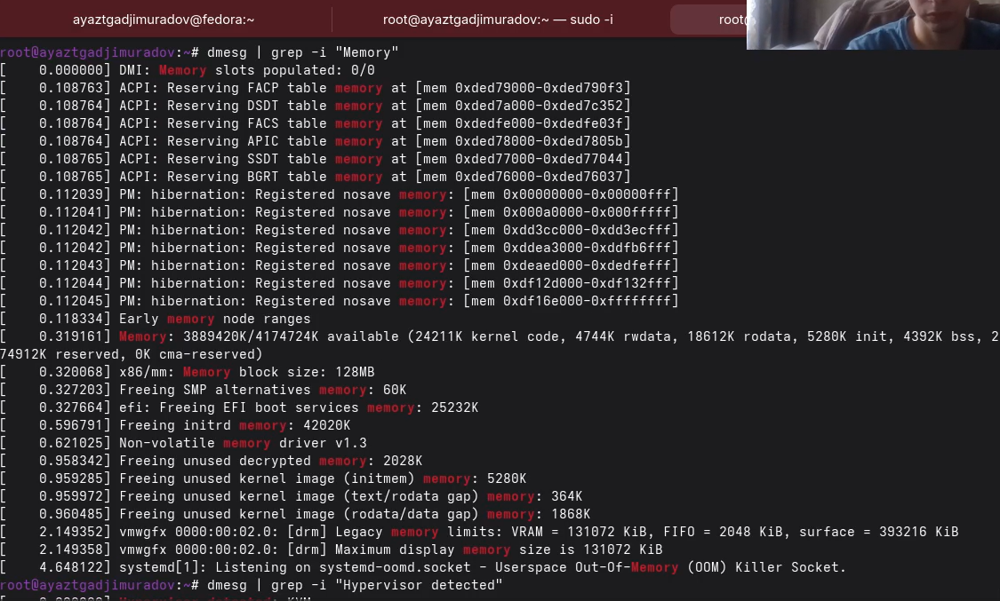
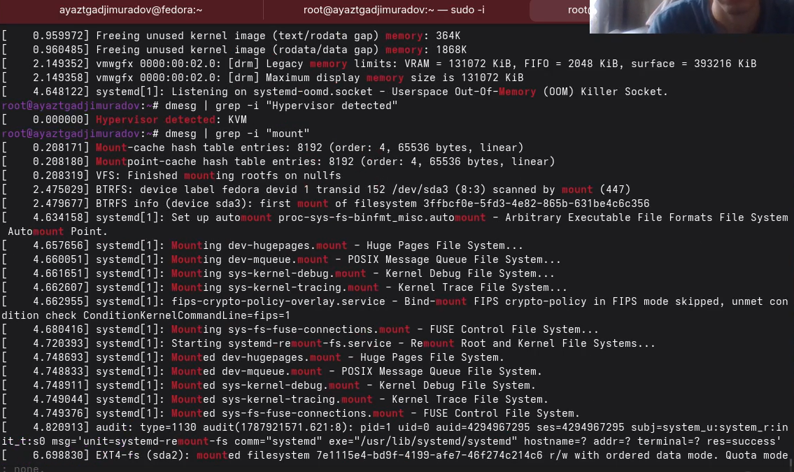

# Цель работы

Целью данной работы является приобретение практических навыков установки
операционной системы на виртуальную машину, настройки минимально
необходимых для дальнейшей работы сервисов.

# Задание

1.  Создание виртуальной машины
2.  Установка операционной системы
3.  Работа с операционной системой после установки
4.  Установка программного обеспечения для работы с документацией
5.  Дополнительные задания

# Выполнение лабораторной работы

# Создание виртуальной машины

Для создания виртуальной машины нам потребуется менеджер виртуальных
машин VirtualBox.

# Создание виртуальной машины на базе ОС Fedora

1.  Нажимаем создать.
2.  В появившемся окне придумываем имя для ВМ.
3.  Выбираем заранее скачанный ISO образ Fedora

{#fig-001 width="70%"}

4.  Выбираем количество оперативной памяти и число процессоров.

{#fig-002 width="70%"}

5.  Указываем размер диска 80ГБ.

{#fig-003 width="70%"}

6.  Перезапускаем машину

# Установка операционной системы

1.  После перезагрузки у нас появится привественное окно, нажимаем
    install fedora linux.

{#fig-004 width="70%"}

2.  Дальше создаем учетную запись по инстуркции на экране и ждем конца
    установки ОС.

3.  После завершения установки перезапускаем ВМ.

# Работа с ОС после установки

1.  Установка драйверов для VirtualBox Запускаем терминальный
    мультиплексор tmux:

tmux

Переключитесь на роль супер-пользователя:

sudo -i

Установите средства разработки:

dnf -y group install development-tools

Установите пакет DKMS:

dnf -y install dkms

В меню виртуальной машины подключите образ диска дополнений гостевой ОС.

Подмонтируйте диск:

mount /dev/sr0 /media

Установите драйвера:

/media/VBoxLinuxAdditions.run

Перегрузите виртуальную машину:

reboot

2.  Обновления

Установите средства разработки:

sudo dnf -y group install development-tools

Обновить все пакеты

sudo dnf -y update

3.  Автоматическое обновление

При необходимости можно использовать автоматическое обновление.

Установка программного обеспечения:

sudo dnf -y install dnf-automatic

Задаёте необходимую конфигурацию в файле /etc/dnf/automatic.conf.

Запустите таймер:

sudo systemctl enable --now dnf-automatic.timer

4.  Отключение SELinux В данном курсе мы не будем рассматривать работу с
    системой безопасности SELinux. Поэтому отключим его.

В файле /etc/selinux/config замените значение

SELINUX=enforcing

на значение

SELINUX=permissive

{#fig-005 width="70%"}

Перегрузите виртуальную машину:

sudo systemctl reboot

5.  Настройка раскладки клавиатуры

Запустите терминальный мультиплексор tmux:

tmux

Создайте конфигурационный файл
\~/.config/sway/config.d/95-system-keyboard-config.conf:

mkdir -p \~/.config/sway touch
\~/.config/sway/config.d/95-system-keyboard-config.conf

Отредактируйте конфигурационный файл
\~/.config/sway/config.d/95-system-keyboard-config.conf:

exec_always /usr/libexec/sway-systemd/locale1-xkb-config --oneshot

{#fig-006 width="70%"}

Переключитесь на роль супер-пользователя:

sudo -i

Отредактируйте конфигурационный файл
/etc/X11/xorg.conf.d/00-keyboard.conf:

Section "InputClass" Identifier "system-keyboard" MatchIsKeyboard "on"
Option "XkbLayout" "us,ru" Option "XkbVariant" ",winkeys" Option
"XkbOptions" "grp:rctrl_toggle,compose:ralt,terminate:ctrl_alt_bksp"
EndSection

Для этого можно использовать файловый менеджер mc и его встроенный
редактор.

{#fig-007 width="70%"}

{#fig-008 width="70%"}

Перегрузите виртуальную машину:

sudo systemctl reboot

6.  Установка имени пользователя и названия хоста

Если при установке виртуальной машины вы задали имя пользователя или имя
хоста, не удовлетворяющее соглашению об именовании, то вам необходимо
исправить это. Запустите виртуальную машину и залогиньтесь. Нажмите
комбинацию Win+Enter для запуска терминала.

Запустите терминальный мультиплексор tmux:

tmux

Переключитесь на роль супер-пользователя:

sudo -i

Создайте пользователя (вместо username укажите ваш логин в дисплейном
классе):

adduser -G wheel username

Задайте пароль для пользователя (вместо username укажите ваш логин в
дисплейном классе):

passwd username

Установите имя хоста (вместо username укажите ваш логин в дисплейном
классе):

hostnamectl set-hostname username

Проверьте, что имя хоста установлено верно:

hostnamectl

{#fig-009 width="70%"}

# Установка программного обеспечения для создания документации

    Запустите терминальный мультиплексор tmux:

    tmux

    Переключитесь на роль супер-пользователя:

    sudo -i

1.  Работа с языком разметки Markdown

    Средство pandoc для работы с языком разметки Markdown.

    Установка с помощью менеджера пакетов:

    sudo dnf -y install pandoc

    Для работы с перекрёстными ссылками мы используем пакет
    pandoc-crossref. Пакет pandoc-crossref в стандартном репозитории
    отсутствует. Придётся ставить вручную, скачав с сайта
    https://github.com/lierdakil/pandoc-crossref. При установке
    pandoc-crossref следует обращать внимание, для какой версии pandoc
    он скомпилён. Лучше установить pandoc и pandoc-crossref вручную.
    Скачайте необходимую версию pandoc-crossref
    (https://github.com/lierdakil/pandoc-crossref/releases). Посмотрите,
    для какой версии откомпилён pandoc-crossref. Скачайте
    соответствующую версию pandoc
    (https://github.com/jgm/pandoc/releases). Распакуйте архивы. Обе
    программы собраны в виде статически-линкованных бинарных файлов.
    Поместите их в каталог /usr/local/bin.

2.  texlive

    Установим дистрибутив TeXlive:

    sudo dnf -y install texlive-scheme-full

# Дополнительные задания

Дождитесь загрузки графического окружения и откройте терминал. В окне
терминала проанализируйте последовательность загрузки системы, выполнив
команду dmesg. Можно просто просмотреть вывод этой команды:

dmesg \| less

Можно использовать поиск с помощью grep:

dmesg \| grep -i "то, что ищем"

# Получите следующую информацию.

Версия ядра Linux (Linux version). Частота процессора (Detected Mhz
processor). Модель процессора (CPU0). Объём доступной оперативной памяти
(Memory available). Тип обнаруженного гипервизора (Hypervisor detected).
Тип файловой системы корневого раздела. Последовательность монтирования
файловых систем.

{#fig-010 width="70%"}

{#fig-011 width="70%"}

{#fig-012 width="70%"}

# Выводы

В ходе выполнения лабораторной работы были успешно приобретены
практические навыки установки операционной системы на виртуальную машину
и настройки базовых сервисов.

# Список литературы {#список-литературы .unnumbered}
