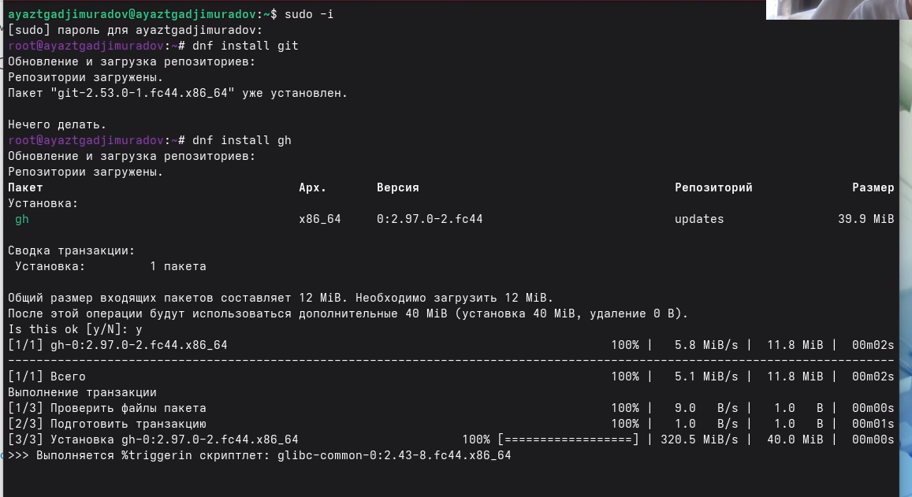
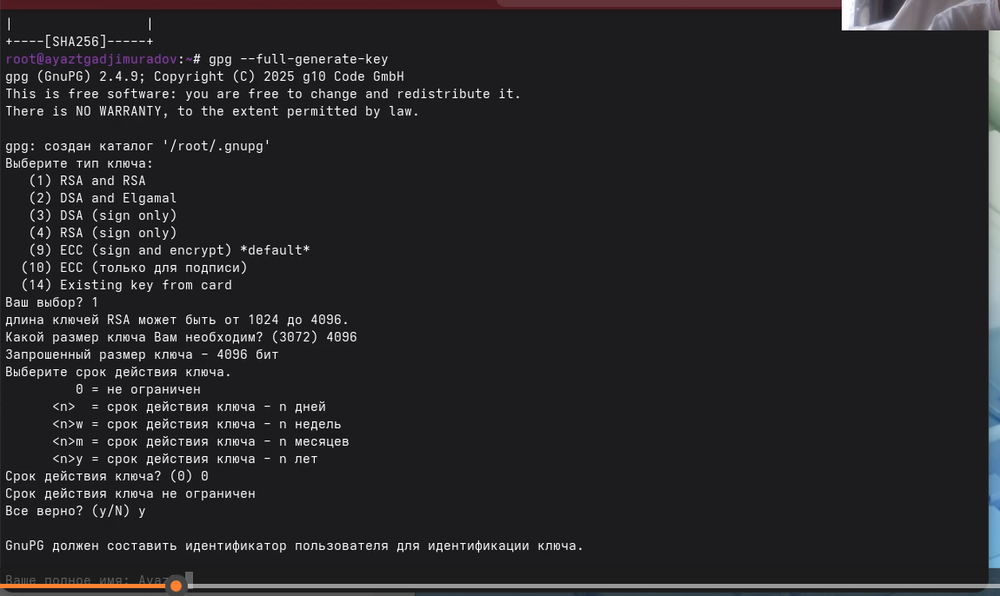
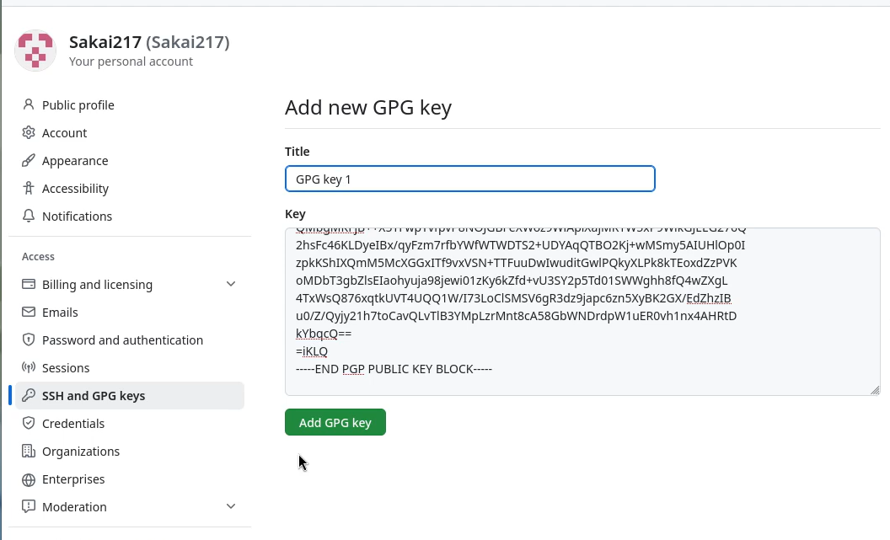

## Цель работы

Изучить идеологию и применение средств контроля версий.
Освоить умения по работе с git.

## Задание

1. Создать базовую конфигурацию для работы с git.
2. Создать ключ SSH.
3. Создать ключ PGP.
4. Настроить подписи git.
5. Зарегистрироваться на Github.
6. Создать локальный каталог для выполнения заданий по предмету.

## Установка программного обеспечения

Установка git

    Установим git:

    dnf install git

Установка gh
    Fedora:
    dnf install gh
{width=70%}
 
## Создайте ключи ssh

    по алгоритму rsa с ключём размером 4096 бит:
    ssh-keygen -t rsa -b 4096
    по алгоритму ed25519:
    ssh-keygen -t ed25519
{width=70%}
    
## Создайте ключи pgp

    Генерируем ключ
    gpg --full-generate-key

{width=70%}
   
## Добавление PGP ключа в GitHub

Выводим список ключей и копируем отпечаток приватного ключа:
gpg --list-secret-keys --keyid-format LONG
{width=70%}
Отпечаток ключа — это последовательность байтов, используемая для идентификации более длинного, по сравнению с самим отпечатком ключа.

## Добавление PGP ключа в GitHub

Формат строки:
sec   Алгоритм/Отпечаток_ключа Дата_создания [Флаги] [Годен_до]
      ID_ключа
Cкопируйте ваш сгенерированный PGP ключ в буфер обмена:
gpg --armor --export <PGP Fingerprint> | xclip -sel clip

{width=70%}
 
## Добавление PGP ключа в GitHub

Перейдите в настройки GitHub (https://github.com/settings/keys), нажмите на кнопку New GPG key и вставьте полученный ключ в поле ввода.

{width=70%}
 
## 

Спасибо за внимание!

