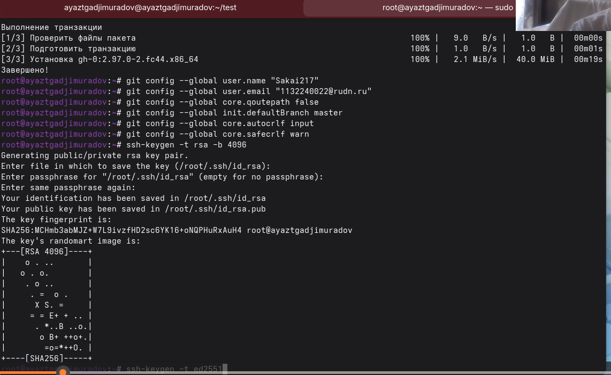
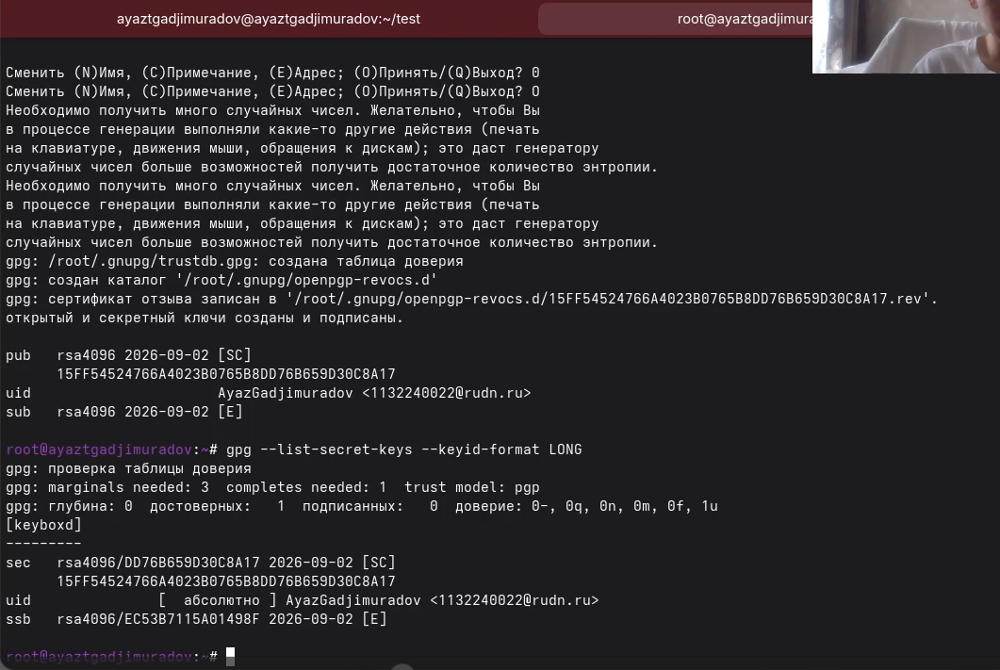
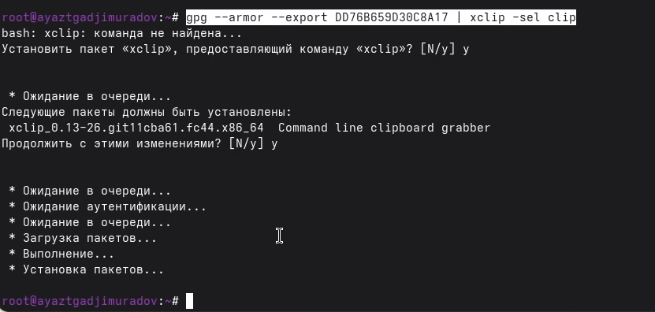

# Отчет выполнения лабораторной работы №1

## Студент

- **ФИО:** Гаджимурадов Аяз Тахирович
- **Группа:** НБИбд-02-25
- **Студенческий билет:** 1132240022

---

## Цель работы

Изучить идеологию и применение средств контроля версий.
Освоить умения по работе с git.

## Теоретические сведения

Системы контроля версий. Общие понятия

Системы контроля версий (Version Control System, VCS) применяются при работе нескольких человек над одним проектом. Обычно основное дерево проекта хранится в локальном или удалённом репозитории, к которому настроен доступ для участников проекта. При внесении изменений в содержание проекта система контроля версий позволяет их фиксировать, совмещать изменения, произведённые разными участниками проекта, производить откат к любой более ранней версии проекта, если это требуется.

В классических системах контроля версий используется централизованная модель, предполагающая наличие единого репозитория для хранения файлов. Выполнение большинства функций по управлению версиями осуществляется специальным сервером. Участник проекта (пользователь) перед началом работы посредством определённых команд получает нужную ему версию файлов. После внесения изменений, пользователь размещает новую версию в хранилище. При этом предыдущие версии не удаляются из центрального хранилища и к ним можно вернуться в любой момент. Сервер может сохранять не полную версию изменённых файлов, а производить так называемую дельта-компрессию — сохранять только изменения между последовательными версиями, что позволяет уменьшить объём хранимых данных.

## Основные команды git

Перечислим наиболее часто используемые команды git.

Создание основного дерева репозитория:

git init

Получение обновлений (изменений) текущего дерева из центрального репозитория:

git pull

Отправка всех произведённых изменений локального дерева в центральный репозиторий:

git push

Просмотр списка изменённых файлов в текущей директории:

git status

Просмотр текущих изменений:

git diff

Сохранение текущих изменений:

    добавить все изменённые и/или созданные файлы и/или каталоги:

    git add .

    добавить конкретные изменённые и/или созданные файлы и/или каталоги:

    git add имена_файлов

    удалить файл и/или каталог из индекса репозитория (при этом файл и/или каталог остаётся в локальной директории):

    git rm имена_файлов

Сохранение добавленных изменений:

    сохранить все добавленные изменения и все изменённые файлы:

    git commit -am 'Описание коммита'

    сохранить добавленные изменения с внесением комментария через встроенный редактор:

    git commit

    создание новой ветки, базирующейся на текущей:

    git checkout -b имя_ветки

    переключение на некоторую ветку:

    git checkout имя_ветки

    (при переключении на ветку, которой ещё нет в локальном репозитории, она будет создана и связана с удалённой)

    отправка изменений конкретной ветки в центральный репозиторий:

    git push origin имя_ветки

    слияние ветки с текущим деревом:

    git merge --no-ff имя_ветки

Удаление ветки:

    удаление локальной уже слитой с основным деревом ветки:

    git branch -d имя_ветки

    принудительное удаление локальной ветки:

    git branch -D имя_ветки

    удаление ветки с центрального репозитория:

    git push origin :имя_ветки
    
## Задание

1. Создать базовую конфигурацию для работы с git.
2. Создать ключ SSH.
3. Создать ключ PGP.
4. Настроить подписи git.
5. Зарегистрироваться на Github.
6. Создать локальный каталог для выполнения заданий по предмету.

## Установка программного обеспечения

Установка git

    Установим git:

    dnf install git

Установка gh

    Fedora:

    dnf install gh
    
 {width=70%}

## Базовая настройка git

Зададим имя и email владельца репозитория:

git config --global user.name "Name Surname"
git config --global user.email "work@mail"

Настроим utf-8 в выводе сообщений git:

git config --global core.quotepath false

Настройте верификацию и подписание коммитов git (см. Верификация коммитов git с помощью GPG).

Зададим имя начальной ветки (будем называть её master):

git config --global init.defaultBranch master

Параметр autocrlf:

git config --global core.autocrlf input

Параметр safecrlf:

git config --global core.safecrlf warn

## Создайте ключи ssh

    по алгоритму rsa с ключём размером 4096 бит:

    ssh-keygen -t rsa -b 4096

    по алгоритму ed25519:

    ssh-keygen -t ed25519
    
    {width=70%}
    
## Создайте ключи pgp

    Генерируем ключ

    gpg --full-generate-key

   {width=70%}
   
## Добавление PGP ключа в GitHub

Выводим список ключей и копируем отпечаток приватного ключа:

gpg --list-secret-keys --keyid-format LONG

 {width=70%}

Отпечаток ключа — это последовательность байтов, используемая для идентификации более длинного, по сравнению с самим отпечатком ключа.

Формат строки:

sec   Алгоритм/Отпечаток_ключа Дата_создания [Флаги] [Годен_до]
      ID_ключа

Cкопируйте ваш сгенерированный PGP ключ в буфер обмена:

gpg --armor --export <PGP Fingerprint> | xclip -sel clip

 {width=70%}

Перейдите в настройки GitHub (https://github.com/settings/keys), нажмите на кнопку New GPG key и вставьте полученный ключ в поле ввода.

 {width=70%}

## Вывод

Исходя из задания и инструкций, мы научились полностью настраивать Git-среду с нуля - установка, генерация SSH и PGP ключей, включение подписей, регистрация на GitHub и подготовка локальной папки под задачи.

