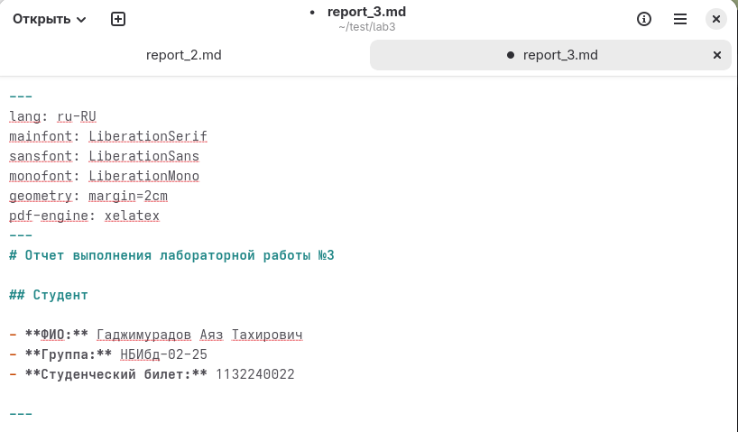
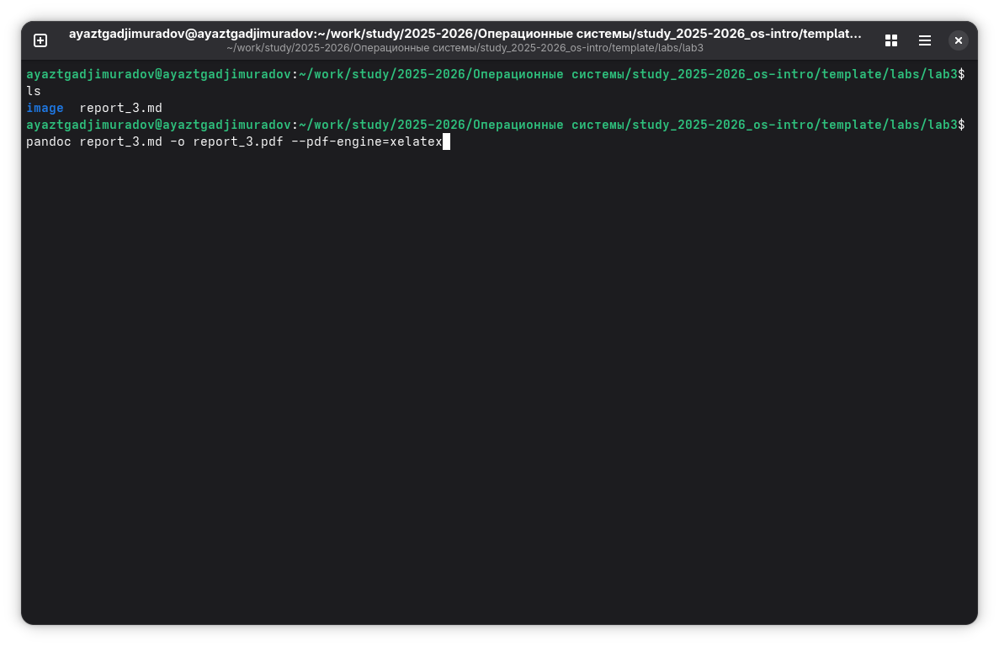

## Титульный слайд

**Дисциплина:** Архитектура компьютеров и операционные системы (раздел «Операционные системы»)  
**Работа:** Лабораторная работа 3 — Markdown

**Студент:** Гаджимурадов Аяз Тахирович  
**Преподаватель:** Кулябов Дмитрий Сергеевич, д.ф.-м.н., профессор  
**Организация:** Российский университет дружбы народов (РУДН)

---

## Цель работы

Научиться оформлять отчеты с помощью легковесного языка разметки Markdown.

## Задание

- Сделать отчёт по предыдущей лабораторной работе в формате Markdown.
- В качестве отчёта предоставить отчёты в 3 форматах: pdf, docx и md (в архиве,
поскольку он должен содержать скриншоты, Makefile и т.д.)

## Теоретические введение

Markdown - это легкий язык разметки для оформления текста. 

Он нужен, чтобы писать читаемый текст в обычном блокноте, который автоматически превращается в красиво отформатированный на GitHub.

## Выполнение лабораторной работы

Перехожу в директорию в которой рапологается шаблон для отчета по лабораторной работе.
Открываю файл шаблона с помощью текстового редактора и начинаю заполнять его.

{width=70%}

## Выполнение лабораторной работы
После изменения шаблона я переименовываю его и выполняю компиляцию в форматы docx и pdf из формата md.

{width=70%}

## Выполнение лабораторной работы

Далее отправляю созданные файлы на глобальный репозиторий.

{width=70%}

## Выполнение лабораторной работы

Завершаю отправку с помощью git push.

{width=70%}

## Вывод

В ходе работы были изучены базовые элементы Markdown.

