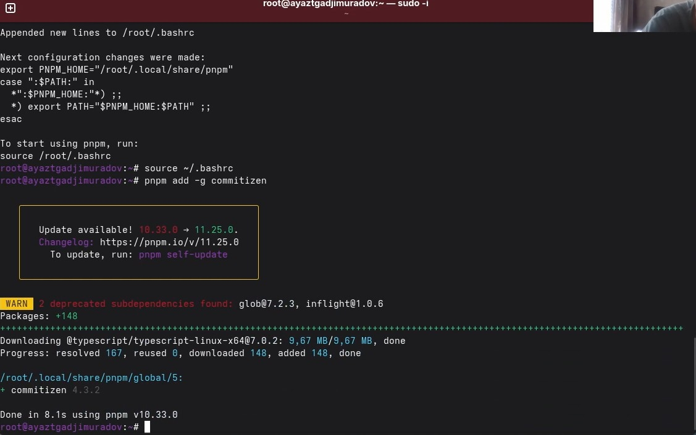
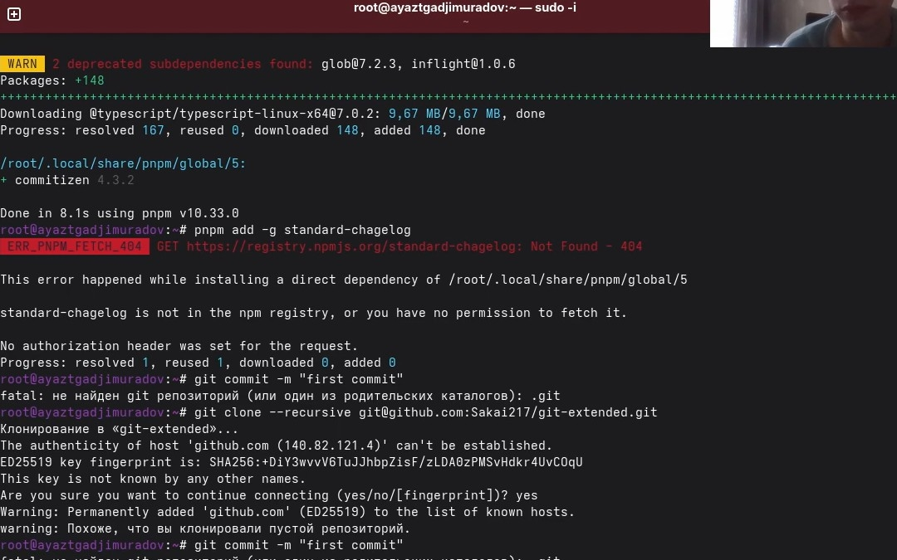
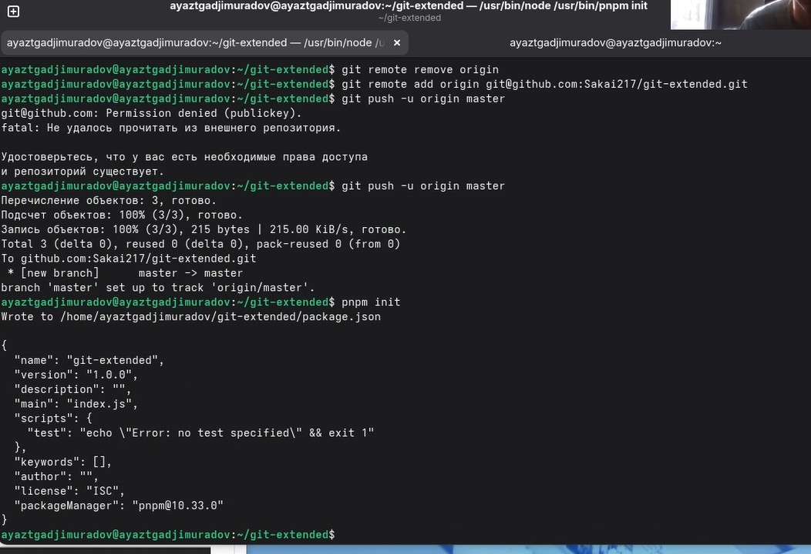
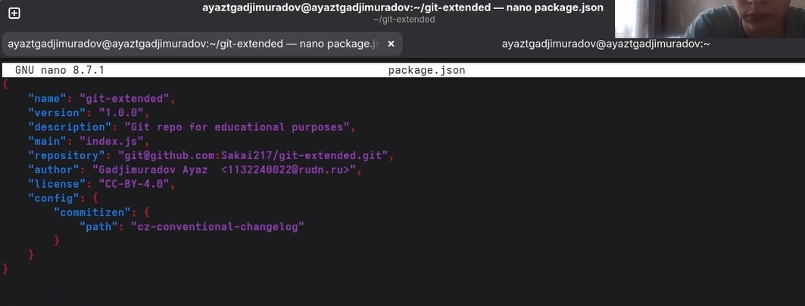
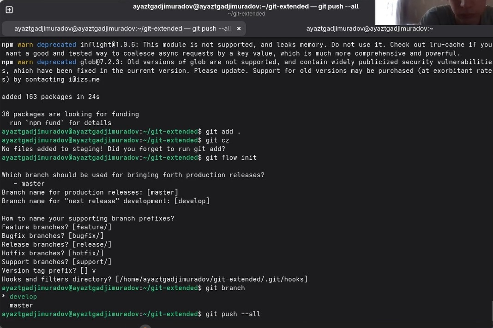

## Титульный слайд

**Дисциплина:** Архитектура компьютеров и операционные системы (раздел «Операционные системы»)  
**Работа:** Лабораторная работа 3 — Markdown

**Студент:** Гаджимурадов Аяз Тахирович  
**Преподаватель:** Кулябов Дмитрий Сергеевич, д.ф.-м.н., профессор  
**Организация:** Российский университет дружбы народов (РУДН)

---

# Цель работы

Получение навыков правильной работы с репозиториями git.

# Теоретические сведения

Рабочий процесс Gitflow Workflow. Будем описывать его с использованием пакета git-flow.

# Задание

Выполнить работу для тестового репозитория.
Преобразовать рабочий репозиторий в репозиторий с git-flow и conventional commits.

# Установка git-flow

Установка из коллекции репозиториев Copr (https://copr.fedorainfracloud.org/coprs/elegos/gitflow/):

 Enable the copr repository
dnf copr enable elegos/gitflow
 Install gitflow
dnf install gitflow

{width=70%}

# Установка Node.js

На Node.js базируется программное обеспечение для семантического версионирования и общепринятых коммитов.

    Fedora

    dnf install nodejs
    dnf install pnpm

# Настройка Node.js

Для работы с Node.js добавим каталог с исполняемыми файлами, устанавливаемыми yarn, в переменную PATH.

    Запустите:
    pnpm setup
    Перелогиньтесь, или выполните:
    source ~/.bashrc
    
{width=70%}

# Создание репозитория git

Создайте репозиторий на GitHub. Для примера назовём его git-extended.
git commit -m "first commit"
git remote add origin git@github.com:<username>/git-extended.git
git push -u origin master

{width=70%}

# Создание репозитория git

Делаем первый коммит и выкладываем на github:

{width=70%}

# Конфигурация общепринятых коммитов

Конфигурация для пакетов Node.js
pnpm init
Сконфигурим формат коммитов. Для этого добавим в файл package.json команду для формирования коммитов:

{width=70%}

# Конфигурация общепринятых коммитов

Добавим новые файлы, Выполним коммит, Отправим на github

{width=70%}

# Конфигурация git-flow

Инициализируем git-flow
Префикс для ярлыков установим в v.

{width=70%}

# Конфигурация git-flow

    Создадим релиз с версией 1.2.3:
    Создадим журнал изменений

    standard-changelog

    Добавим журнал изменений в индекс

    git add CHANGELOG.md
    git commit -am 'chore(site): update changelog'

    Зальём релизную ветку в основную ветку. Отправим данные на github
    
{width=70%}
    
# Создание релиза git-flow
    
    Создадим релиз на github с комментарием из журнала изменений:
    gh release create v1.2.3 -F CHANGELOG.md
    
{width=70%}
