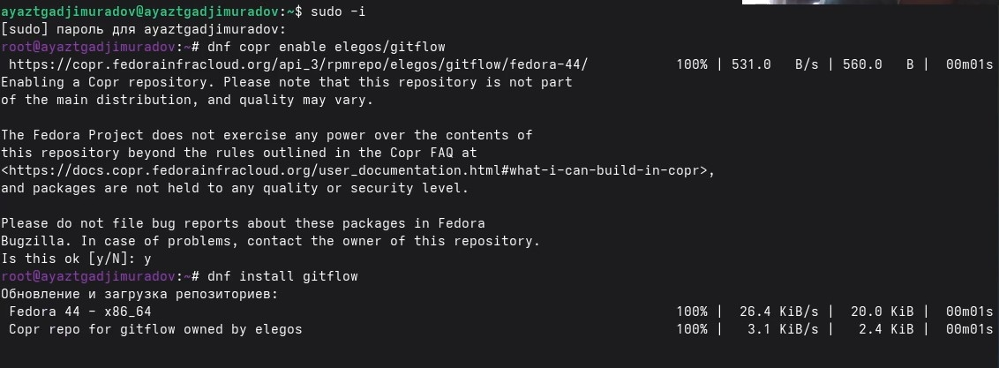
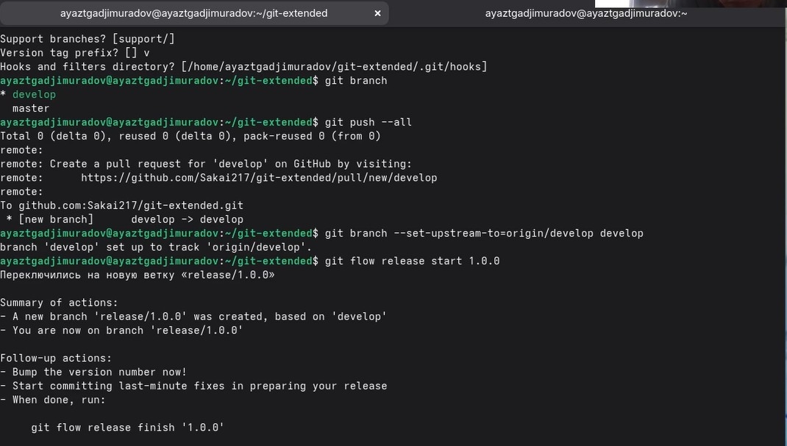
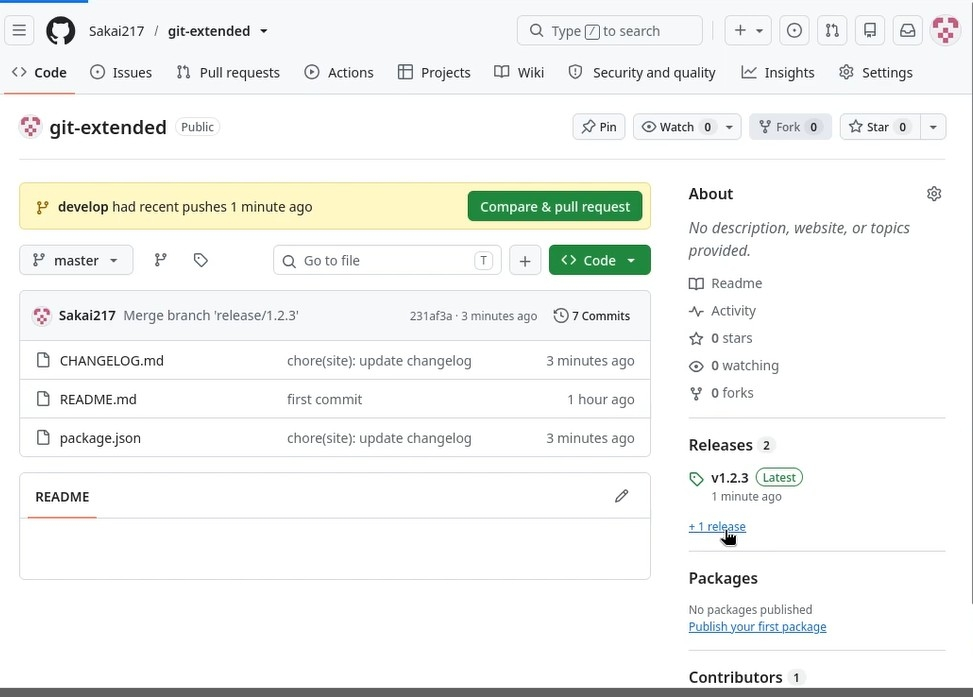

# Цель работы 

Получение навыков правильной работы с репозиториями git.

# Теоретические сведения
## Рабочий процесс Gitflow

Рабочий процесс Gitflow Workflow. Будем описывать его с использованием пакета git-flow.

# Задание

Выполнить работу для тестового репозитория.
Преобразовать рабочий репозиторий в репозиторий с git-flow и conventional commits.

# Установка программного обеспечения
## Установка git-flow

Установка из коллекции репозиториев Copr (https://copr.fedorainfracloud.org/coprs/elegos/gitflow/):

 Enable the copr repository
dnf copr enable elegos/gitflow
 Install gitflow
dnf install gitflow

{width=70%}

## Установка Node.js

На Node.js базируется программное обеспечение для семантического версионирования и общепринятых коммитов.

    Fedora

    dnf install nodejs
    dnf install pnpm

## Настройка Node.js

Для работы с Node.js добавим каталог с исполняемыми файлами, устанавливаемыми yarn, в переменную PATH.

    Запустите:

    pnpm setup

    Перелогиньтесь, или выполните:

    source ~/.bashrc
    
{width=70%}

# Практический сценарий использования git
## Создание репозитория git

Создайте репозиторий на GitHub. Для примера назовём его git-extended.

Делаем первый коммит и выкладываем на github:

git commit -m "first commit"
git remote add origin git@github.com:<username>/git-extended.git
git push -u origin master

{width=70%}

{width=70%}

Конфигурация для пакетов Node.js

pnpm init

Сконфигурим формат коммитов. Для этого добавим в файл package.json команду для формирования коммитов:

{width=70%}

Добавим новые файлы, Выполним коммит, Отправим на github

{width=70%}

## Конфигурация git-flow

Инициализируем git-flow
Префикс для ярлыков установим в v.

{width=70%}

## Создание релиза git-flow

    Создадим релиз с версией 1.2.3:

    git flow release start 1.2.3

    Обновите номер версии в файле package.json. Установите её в 1.2.3.

    Создадим журнал изменений

    standard-changelog

    Добавим журнал изменений в индекс

    git add CHANGELOG.md
    git commit -am 'chore(site): update changelog'

    Зальём релизную ветку в основную ветку

    git flow release finish 1.2.3

    Отправим данные на github

    git push --all
    git push --tags
    
    {width=70%}
    
    Создадим релиз на github с комментарием из журнала изменений:
    gh release create v1.2.3 -F CHANGELOG.md
    
    {width=70%}
    
# Вывод

В ходе работы были получены навыки работы с репозиториями git. Мы научились преобразовывать рабочий репозиторий с git-flow и conventional commits.

