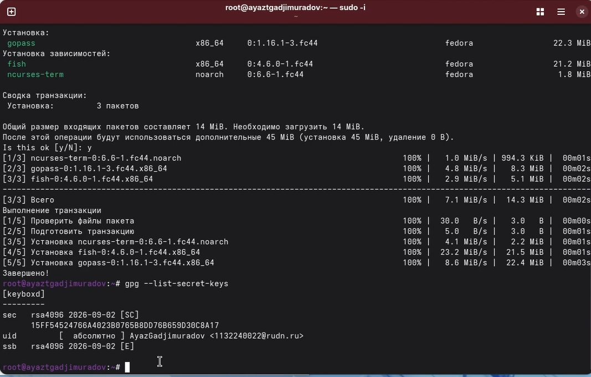
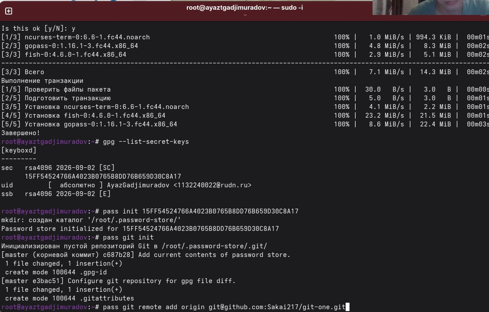
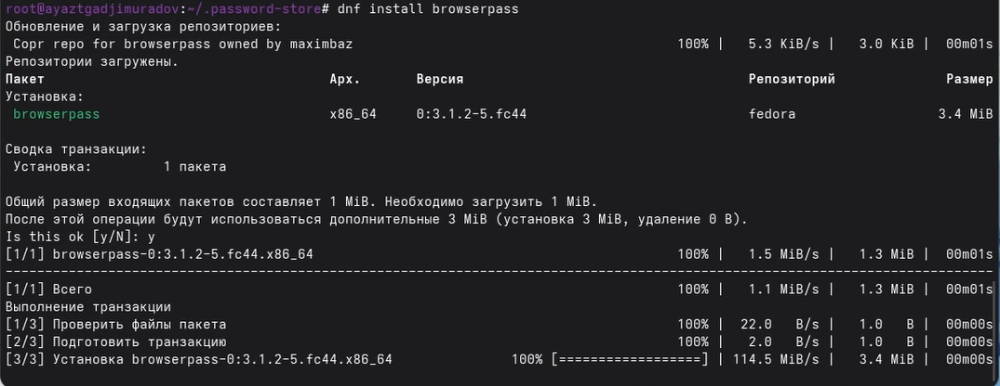
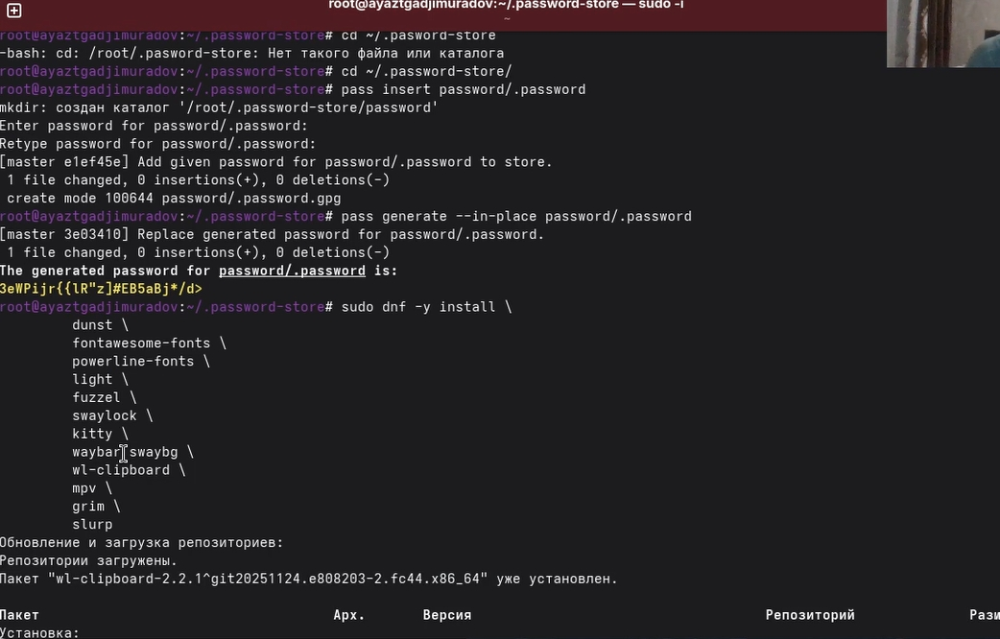
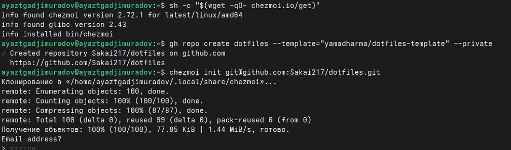
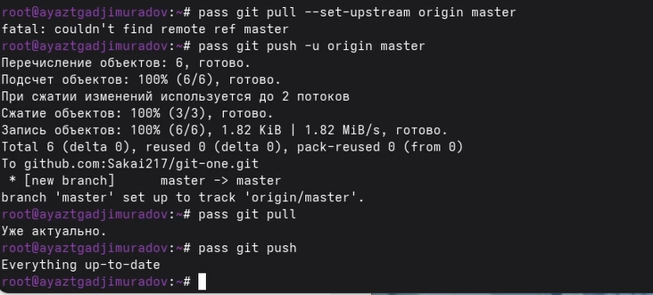
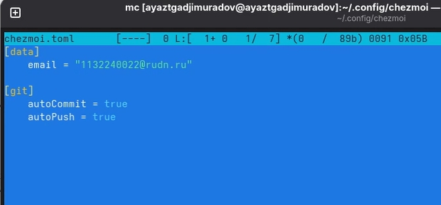

# Цель работы 

Целью работы является научится настраивать рабочую среду

# Задание

1. Менеджер паролей pass
2. Настройка интерфейса с броузером
3. Сохранение пароля
4. Управление файлами конфигурации
5. Создание собственного репозитория с помощью утилит
6. Подключение репозитория к своей системе

# Теоретическое введение

Менеджер паролей pass — программа, сделанная в рамках идеологии Unix.
Также носит название стандартного менеджера паролей для Unix (The standard Unix password manager).

# Установка Fedora

pass:
dnf install pass pass-otp
gopass:
dnf install gopass

# Настройка

Ключи GPG
    Просмотр списка ключей:
    gpg --list-secret-keys
    Если ключа нет, нужно создать новый:
    gpg --full-generate-key

{width=70%}

# Синхронизация с git

Создадим структуру git:
pass git init
Также можно задать адрес репозитория на хостинге (репозиторий необходимо предварительно создать):
pass git remote add origin git@github.com:git_username/git_repo.git
Для синхронизации выполняется следующая команда:
pass git pull
pass git push

{width=70%}

# Настройка интерфейса с броузером

Для взаимодействия с броузером используется интерфейс native messaging.
Поэтому кроме плагина к броузеру устанавливается программа, обеспечивающая интерфейс native messaging.

Плагин browserpass

    Репозиторий: https://github.com/browserpass/browserpass-extension
    Плагин для брoузера
    Плагин для Firefox: https://addons.mozilla.org/en-US/firefox/addon/browserpass-ce/.
    Плагин для Chrome/Chromium: https://chrome.google.com/webstore/detail/browserpass-c
    naepdomgkenhinolocfifgehidddafch.
    Интерфейс для взаимодействия с броузером (native messaging)
    Репозиторий: https://github.com/browserpass/browserpass-native

    Gentoo:
    emerge www-plugins/browserpass
    Fedora
    dnf copr enable maximbaz/browserpass
    dnf install browserpass

{width=70%}

# Сохранение пароля

Добавить новый пароль

{width=70%}

# Дополнительное программное обеспечение

Установите дополнительное программное обеспечение:
    sudo dnf copr enable peterwu/iosevka
    sudo dnf search iosevka
    sudo dnf install iosevka-fonts iosevka-aile-fonts iosevka-curly-fonts iosevka-slab-fonts 
    iosevka-etoile-fonts iosevka-term-fonts
    
{width=70%}

# Установка

    Установка бинарного файла. Скрипт определяет архитектуру процессора и операционную систему и скачивает необходимый файл:

    с помощью wget:

    sh -c "$(wget -qO- chezmoi.io/get)"

{width=70%}

# Создание собственного репозитория с помощью утилит

    Будем использовать утилиты командной строки для работы с github.

    Создадим свой репозиторий для конфигурационных файлов на основе шаблона:

    gh repo create dotfiles --template="yamadharma/dotfiles-template" --private

# Подключение репозитория к своей системе

    Инициализируйте chezmoi с вашим репозиторием dotfiles:

    chezmoi init git@github.com:<username>/dotfiles.git

    Проверьте, какие изменения внесёт chezmoi в домашний каталог, запустив:

    chezmoi diff

    Если вас устраивают изменения, внесённые chezmoi, запустите:

    chezmoi apply -v
    
{width=70%} 

# Подключение репозитория к своей системе

Можно автоматически фиксировать и отправлять изменения в исходный каталог в репозиторий.
Эта функция отключена по умолчанию.

Чтобы включить её, добавьте в файл конфигурации ~/.config/chezmoi/chezmoi.toml следующее:

[git]
    autoCommit = true
    autoPush = true
    
{width=70%} 

